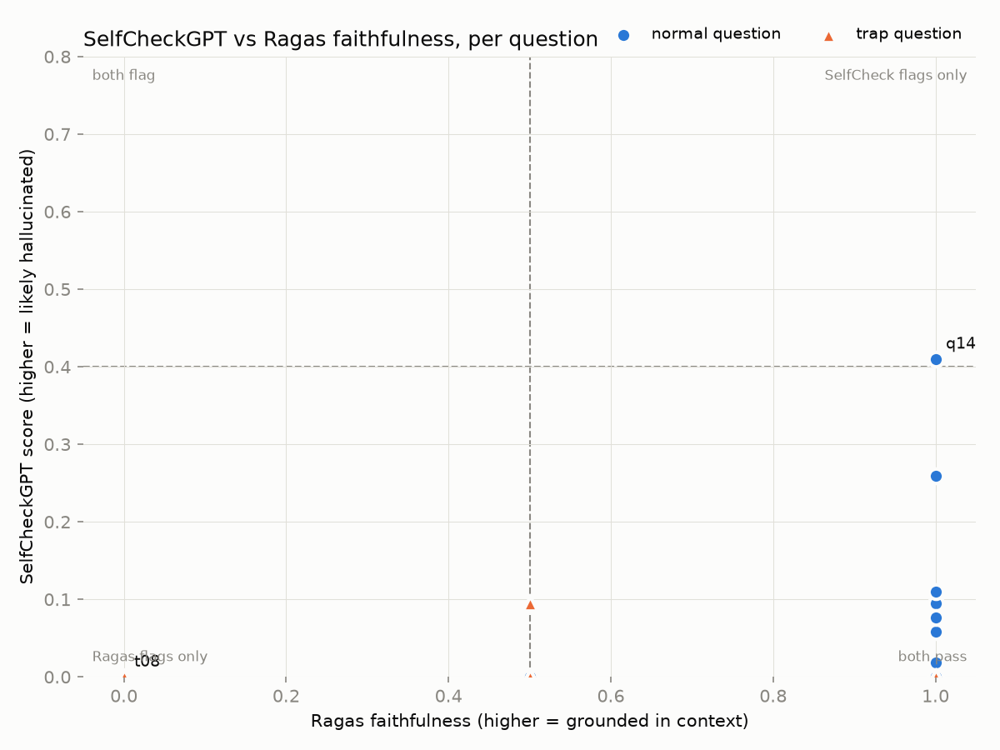

# CrossCheck

**Detecting hallucinations in a RAG pipeline two ways, SelfCheckGPT and Ragas, and examining where they disagree.**

A small retrieval-augmented support assistant, plus two independent ways of catching its hallucinations, run side by side on the same answers:

1. **SelfCheckGPT (BERTScore variant), reimplemented from the paper.** It samples the generator several times and flags sentences the samples don't agree with. No reference answer or retrieved context is needed.
2. **Ragas**, the standard LLM-as-judge RAG evaluation framework, scoring faithfulness, answer relevancy, context precision and context recall.

The output is a per-question comparison that shows where the two methods disagree, and why.



## Pipeline

```
docs/knowledge_base/*.md ──▶ chunk (200 words, 40 overlap) ──▶ MiniLM embeddings ──▶ FAISS (cosine)
                                                                                          │ top-3
eval/eval_questions.json ──▶ prompt (answer only from context, else "I don't know") ◀────┘
                                          │
                     ┌────────────────────┴────────────────────┐
             greedy answer (T=0)                     5 stochastic samples (T=1)
                     │                                          │
                     ├───────────────▶ SelfCheckGPT ◀───────────┘   (answer vs samples)
                     └───────────────▶ Ragas (answer + contexts + reference)
                                          │
                                          ▼
                     results/comparison.{md,csv,png}: per-question verdicts
```

## What is implemented here vs. used as a library

| Part | File | Status |
|---|---|---|
| SelfCheckGPT scoring (Manakul et al., 2023, Eq. 1) | `src/selfcheck.py` | **Implemented from the paper.** The `selfcheckgpt` package is not used. |
| BERTScore (Zhang et al., 2020): layer-wise token embeddings, greedy cosine matching, F1, baseline rescaling | `src/selfcheck.py` | **Implemented from the paper** in PyTorch. The `bert_score` package is not used. |
| Chunking, indexing, retrieval | `src/indexing.py`, `src/retriever.py` | Own code on top of `sentence-transformers` and `faiss` |
| Prompting, greedy + sampled generation | `src/generator.py` | Own code, OpenAI-compatible client pointed at OpenRouter |
| Comparison, verdicts, report and chart | `src/compare.py` | Own code |
| Ragas metrics | `src/ragas_eval.py` | **Library** (`ragas`), used on purpose as the independent reference evaluator |
| Knowledge base (20 docs, fictional "Nimbus" devices) and eval set | `docs/`, `eval/` | Written for this project |

The official SelfCheckGPT repository ([potsawee/selfcheckgpt](https://github.com/potsawee/selfcheckgpt)) was used only to check that the formulation matches the paper.

### SelfCheckGPT, as implemented

For each sentence $r_i$ of the greedy answer and each of the $N$ samples $S^n$ (split into sentences $s_k^n$):

$$S_{\text{BERT}}(i) = 1 - \frac{1}{N}\sum_{n=1}^{N} \max_k \; \text{BERTScore-F1}(r_i, s_k^n)$$

Per-sentence scores are clipped to [0, 1]. The passage score is their mean, and higher means more likely hallucinated.

BERTScore is computed from RoBERTa hidden states:
- Layer 10 of `roberta-base`, with `<s>`/`</s>` dropped and vectors L2-normalised.
- Recall and precision come from greedy max-cosine matching in each direction, and are combined into F1.
- F1 is rescaled with `(F1 − b) / (1 − b)`. The baseline `b` is the mean raw F1 of 200 random sentence pairs from this project's own knowledge base.

## Setup

Python 3.13 was used for the included results.

```bash
python -m venv .venv
source .venv/bin/activate          # Windows: .venv\Scripts\activate
pip install -r requirements.txt
python -m spacy download en_core_web_sm
cp .env.example .env               # then set OPENROUTER_API_KEY
```

The generator and the Ragas judge both use `LLM_MODEL` (default `openai/gpt-4o-mini`) through OpenRouter. Any OpenAI-compatible endpoint works if you set `LLM_BASE_URL`. Embeddings and BERTScore run locally on the CPU.

## Usage

```bash
python run_demo.py                  # full run: index → answer → SelfCheckGPT → Ragas → report
python run_demo.py --limit 5 --samples 3    # quick run

python -m src.selfcheck             # SelfCheckGPT sanity check on consistent vs. divergent samples
python -m src.retriever "How much does a screen repair cost?"
python -m src.generator "How long is the warranty on a Nimbus phone?"
```

Outputs go to `results/`:
- `generations.json`: answers, samples, contexts and per-sentence SelfCheck scores
- `comparison.csv` and `comparison.md`: all metrics plus a verdict per question
- `comparison.png`: the chart above

## Evaluation set

There are 24 hand-written questions, each with a reference answer:
- **15 normal** questions, answerable from the knowledge base.
- **9 trap** questions that *sound* answerable but aren't: facts that are missing or deliberately left unspecified (e.g. "Which chip does the Watch S use?", "How long does express shipping take to Japan?"). They test whether the system makes up plausible details.

## Results

These come from the included run: `gpt-4o-mini`, 5 samples per question. SelfCheck flags an answer when its score is > 0.4, and Ragas flags it when faithfulness is < 0.5.

| Verdict | Count |
|---|---|
| Both methods: grounded | 22 |
| Only SelfCheckGPT flags | 1 |
| Only Ragas flags | 1 |
| Both flag a hallucination | 0 |

The generator declined all 9 trap questions ("I don't know based on the provided documents"). On t01 it first stated the grounded fact that the Watch S does not measure blood pressure. It didn't hallucinate on any question. **Both disagreements are false positives, one from each method**, and each points to a different weakness.

**q14: SelfCheckGPT flags a correct answer (score 0.41, faithfulness 1.00).**
*"Can a Phone X2 bought in Canada be serviced in the UK?"* The answer's second sentence, "It can only be serviced in the country or region where it was originally purchased", scored 0.60. Three of the five samples gave the equivalent, more specific statement "only in Canada or the United States". Both are correct according to the source document. BERTScore measures how similar the wording is, not whether one statement implies the other, so consistent answers worded differently look like disagreement.

**t08: Ragas gives a correct refusal 0 faithfulness (SelfCheck 0.00).**
*"How long does express shipping take to Japan?"* The knowledge base doesn't say, and the model correctly declined. Ragas's faithfulness metric breaks an answer into claims and checks each one against the context. A refusal has no supported claims, so it can score 0 (or NaN, which the comparison treats as a pass). A related issue: several correct refusals, and the verbatim-correct q02, received 0.5. So the LLM judge is noisy on very short answers.

**Takeaway.** SelfCheckGPT needs no ground truth and is cheap once you have the samples, but its BERTScore variant confuses rewording with contradiction. Ragas is grounded in the retrieved context, but its faithfulness score is ill-defined for refusals and noisy on one-line answers. A production check would use both, and would switch SelfCheckGPT to an entailment-based (NLI) scorer.

## Design decisions

- **BERTScore variant of SelfCheckGPT.** It's the cheapest variant: one forward pass per sentence, cached, with no extra LLM calls. It's also the one whose parts (contextual embeddings, token alignment, rescaling) are most instructive to build by hand.
- **`roberta-base` instead of the paper's `roberta-large`.** This keeps CPU and RAM use laptop-friendly. Layer 10 is the layer `bert_score` recommends for `roberta-base`.
- **Rescaling baseline estimated from the corpus.** `bert_score` ships pre-computed baselines instead. Estimating it from this domain keeps unrelated sentences near 0 and identical ones at 1, which makes the 0.4 threshold easier to interpret.
- **Greedy answer at T=0, samples at T=1.** This matches the paper's setup: the answer being checked is the model's most likely output, and the samples show how much it could vary.
- **One model for generation and judging.** This keeps the setup to a single API key. The trade-off is possible self-preference bias in Ragas. Pointing `LLM_MODEL` at a stronger judge is a one-line change.
- **Refusals count as grounded.** NaN faithfulness on a refusal is treated as a pass, not a hallucination (see `src/compare.py`).

## Limitations and next steps

- The eval set is small (24 questions) and comes from a single run, so the counts above are illustrative, not statistically meaningful. Next: more questions, repeated runs, and bootstrap confidence intervals on agreement.
- The generator never actually hallucinated, so this run measures false positives only. Next: a weaker model or a less strict prompt to produce real hallucinations and measure how many each method catches.
- Next: an NLI variant of SelfCheckGPT (e.g. DeBERTa-MNLI contradiction probability) to fix the paraphrase false positive in q14.
- Next: package the pipeline as a containerised service (e.g. a REST endpoint that scores an answer plus its samples).

## References

- P. Manakul, A. Liusie, M. J. F. Gales. *SelfCheckGPT: Zero-Resource Black-Box Hallucination Detection for Generative Large Language Models.* EMNLP 2023.
- T. Zhang, V. Kishore, F. Wu, K. Q. Weinberger, Y. Artzi. *BERTScore: Evaluating Text Generation with BERT.* ICLR 2020.
- S. Es, J. James, L. Espinosa-Anke, S. Schockaert. *Ragas: Automated Evaluation of Retrieval Augmented Generation.* EACL 2024 (demo track).
